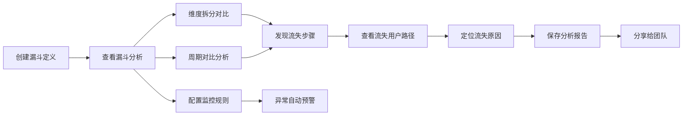

## 1. 产品概述

用户行为漏斗分析工具是一款面向产品运营人员的自助式数据分析平台。运营人员可通过可视化界面自定义转化漏斗步骤，系统自动从埋点数据中计算每步转化率与流失率，支持多维度用户分群对比、周期对比分析、流失用户行为路径追溯，并提供报告保存分享与自动化监控预警功能。

- 目标用户：产品运营人员、数据分析师、产品经理
- 核心价值：降低数据分析门槛，让运营人员自助完成漏斗分析，快速发现转化瓶颈，驱动业务增长

## 2. 核心功能

### 2.1 用户角色
| 角色 | 登录方式 | 核心权限 |
|------|----------|----------|
| 运营人员 | 账号登录 | 创建/编辑漏斗、查看分析、生成报告、配置监控 |
| 团队成员 | 报告链接访问 | 查看分享的报告（只读） |

### 2.2 功能模块
1. **漏斗管理页**：漏斗列表、创建/编辑漏斗、删除漏斗
2. **漏斗分析页**：漏斗可视化、转化率/流失率展示、用户分群筛选、周期对比
3. **流失分析页**：流失用户列表、行为路径追溯、最后操作分析
4. **报告管理页**：报告列表、创建报告、分享报告、查看报告
5. **监控配置页**：监控规则配置、预警阈值设置、通知人管理

### 2.3 页面详情
| 页面名称 | 模块名称 | 功能描述 |
|----------|----------|----------|
| 漏斗管理页 | 漏斗列表 | 展示所有漏斗卡片，支持搜索、筛选、分页 |
| 漏斗管理页 | 新建漏斗 | 可视化拖拽配置漏斗步骤，选择事件、设置筛选条件 |
| 漏斗分析页 | 漏斗图表 | 倒三角漏斗图展示各步骤用户数和转化率 |
| 漏斗分析页 | 分群筛选 | 按来源渠道、注册时间、城市等属性拆分对比 |
| 漏斗分析页 | 周期对比 | 选择两个时间段对比漏斗数据变化趋势 |
| 流失分析页 | 流失用户列表 | 展示某步流失的用户明细，支持分页 |
| 流失分析页 | 行为路径图 | Sankey图展示流失前的用户行为路径 |
| 报告管理页 | 报告列表 | 展示已保存的报告，支持搜索、分享、删除 |
| 报告管理页 | 报告详情 | 完整展示漏斗分析结果和结论 |
| 监控配置页 | 监控规则 | 配置监控漏斗、预警阈值、检测频率 |
| 监控配置页 | 通知设置 | 配置预警通知人、通知渠道（邮件） |

## 3. 核心流程

运营人员进入系统后，首先创建漏斗定义（选择转化事件序列），然后进入分析页面查看漏斗转化数据。可通过维度筛选和周期对比深入分析，发现流失严重的步骤后，点击查看流失用户的行为路径，定位流失原因。分析完成后保存为报告并分享给团队成员。同时可配置监控规则，当转化率异常下降时自动收到预警通知。

## 4. 用户界面设计

### 4.1 设计风格
- 主色调：深蓝 (#1e3a5f) 搭配 活力橙 (#ff6b35) 作为强调色
- 辅助色：浅灰蓝背景 (#f5f7fa)，白色卡片，深灰文字 (#2d3748)
- 按钮风格：圆角矩形按钮，主按钮渐变填充，次按钮描边样式
- 字体：标题使用 Playfair Display，正文使用 Inter
- 布局风格：左侧导航栏 + 右侧内容区，卡片式布局，阴影柔和
- 图标风格：线性简约图标，使用 Lucide 图标库

### 4.2 页面设计概述
| 页面名称 | 模块名称 | UI元素 |
|----------|----------|--------|
| 漏斗管理页 | 漏斗列表 | 卡片网格布局，悬停上浮效果，渐变背景 |
| 漏斗管理页 | 新建漏斗 | 右侧抽屉式表单，步骤拖拽排序，事件选择器 |
| 漏斗分析页 | 漏斗图表 | SVG漏斗图，渐变色填充，数据标签动画 |
| 漏斗分析页 | 分群对比 | 多色并列漏斗，图例交互，悬停高亮 |
| 流失分析页 | 行为路径 | Sankey流图，节点交互，流向动画 |
| 报告管理页 | 报告列表 | 表格布局，操作列按钮，分享链接弹窗 |
| 监控配置页 | 规则列表 | 开关控件，阈值滑块，通知人标签 |

### 4.3 响应式
- 桌面端优先设计，最小支持 1280px 宽度
- 侧边栏可折叠，适配中等屏幕
- 图表自适应容器宽度

### 4.4 动效设计
- 页面加载：元素渐入 + 轻微上移动画
- 漏斗图：从上至下逐层填充动画
- 数据切换：数字滚动过渡效果
- 卡片悬停：微微上浮 + 阴影加深
- 模态框/抽屉：滑入 + 背景淡入
