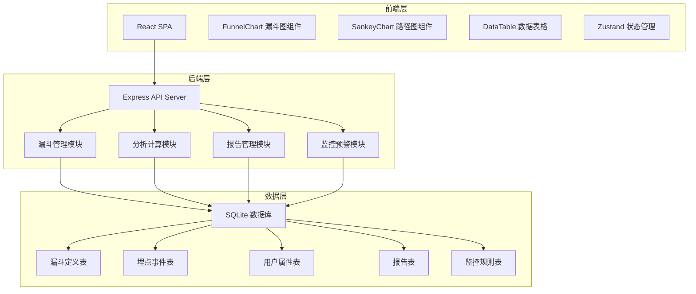
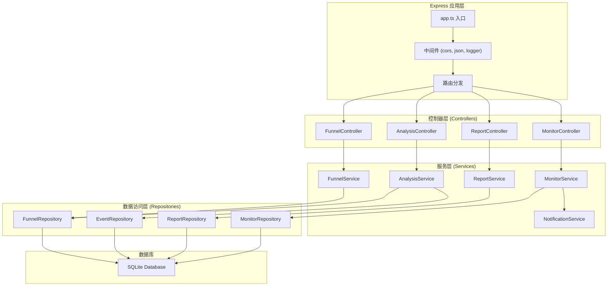
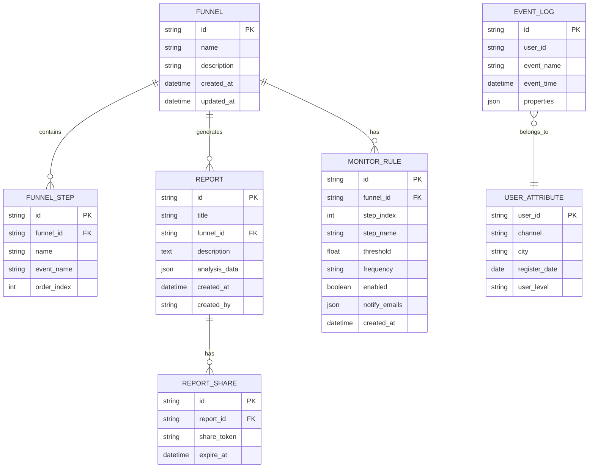

## 1. 架构设计



## 2. 技术描述

- 前端：React@18 + TypeScript + Vite + TailwindCSS@3 + Zustand + Lucide React
- 后端：Express@4 + TypeScript
- 数据库：SQLite（内嵌式，零配置，便于演示）
- 图表：自定义 SVG 图表组件（漏斗图、Sankey路径图）
- 初始化工具：vite-init
- 数据：内置 Mock 数据，模拟真实埋点场景

## 3. 路由定义

### 前端路由
| 路由路径 | 页面名称 | 说明 |
|----------|----------|------|
| / | 漏斗管理页 | 漏斗列表、新建漏斗入口 |
| /funnel/:id | 漏斗分析页 | 漏斗图表、分群对比、周期对比 |
| /funnel/:id/churn | 流失分析页 | 流失用户列表、行为路径 |
| /reports | 报告管理页 | 报告列表、分享功能 |
| /reports/:id | 报告详情页 | 查看分享的报告 |
| /monitor | 监控配置页 | 监控规则、通知设置 |

### 后端 API 路由
| 方法 | 路径 | 说明 |
|------|------|------|
| GET | /api/funnels | 获取漏斗列表 |
| POST | /api/funnels | 创建漏斗 |
| GET | /api/funnels/:id | 获取漏斗详情 |
| PUT | /api/funnels/:id | 更新漏斗 |
| DELETE | /api/funnels/:id | 删除漏斗 |
| GET | /api/funnels/:id/analyze | 漏斗分析计算 |
| GET | /api/funnels/:id/churn | 流失用户列表 |
| GET | /api/funnels/:id/paths | 流失用户行为路径 |
| GET | /api/events | 获取埋点事件列表 |
| GET | /api/user-attributes | 获取用户属性维度 |
| GET | /api/reports | 获取报告列表 |
| POST | /api/reports | 创建报告 |
| GET | /api/reports/:id | 获取报告详情 |
| POST | /api/reports/:id/share | 分享报告 |
| GET | /api/monitors | 获取监控规则列表 |
| POST | /api/monitors | 创建监控规则 |
| PUT | /api/monitors/:id | 更新监控规则 |
| DELETE | /api/monitors/:id | 删除监控规则 |

## 4. API 数据类型定义

```typescript
// 漏斗步骤
interface FunnelStep {
  id: string;
  name: string;
  event: string;
  order: number;
}

// 漏斗定义
interface Funnel {
  id: string;
  name: string;
  description: string;
  steps: FunnelStep[];
  createdAt: string;
  updatedAt: string;
}

// 漏斗分析结果步骤
interface FunnelAnalysisStep {
  stepId: string;
  stepName: string;
  userCount: number;
  conversionRate: number; // 相对第一步
  stepConversionRate: number; // 相对上一步
  dropOffCount: number;
  dropOffRate: number;
}

// 漏斗分析结果
interface FunnelAnalysis {
  funnelId: string;
  funnelName: string;
  totalUsers: number;
  steps: FunnelAnalysisStep[];
  period: {
    start: string;
    end: string;
  };
  breakdown?: {
    dimension: string;
    groups: {
      groupName: string;
      steps: FunnelAnalysisStep[];
    }[];
  };
  compare?: {
    periodLabel: string;
    steps: FunnelAnalysisStep[];
  }[];
}

// 流失用户
interface ChurnUser {
  userId: string;
  lastAction: string;
  lastActionTime: string;
  userAttributes: Record<string, string>;
}

// 行为路径节点
interface PathNode {
  id: string;
  name: string;
  value: number;
}

// 行为路径连接
interface PathLink {
  source: string;
  target: string;
  value: number;
}

// 行为路径数据
interface BehaviorPath {
  nodes: PathNode[];
  links: PathLink[];
}

// 报告
interface Report {
  id: string;
  title: string;
  funnelId: string;
  funnelName: string;
  description: string;
  analysisData: FunnelAnalysis;
  shareToken?: string;
  createdAt: string;
  createdBy: string;
}

// 监控规则
interface MonitorRule {
  id: string;
  funnelId: string;
  funnelName: string;
  stepIndex: number;
  stepName: string;
  threshold: number; // 下降百分比阈值
  frequency: 'daily' | 'hourly';
  enabled: boolean;
  notifyEmails: string[];
  createdAt: string;
}
```

## 5. 服务器架构图



## 6. 数据模型

### 6.1 数据模型ER图



### 6.2 数据初始化脚本

系统启动时自动初始化 SQLite 数据库，创建所有表结构，并生成 Mock 数据：
- 生成 10000+ 条模拟埋点事件数据
- 覆盖注册、完善资料、浏览商品、加入购物车、下单、支付等典型事件
- 用户属性包含：来源渠道（自然搜索/广告投放/社交媒体/直接访问）、城市（北上广深等）、注册时间、用户等级
- 预置 3 个示例漏斗：注册转化漏斗、购买转化漏斗、用户活跃漏斗
- 预置 2 个示例监控规则
